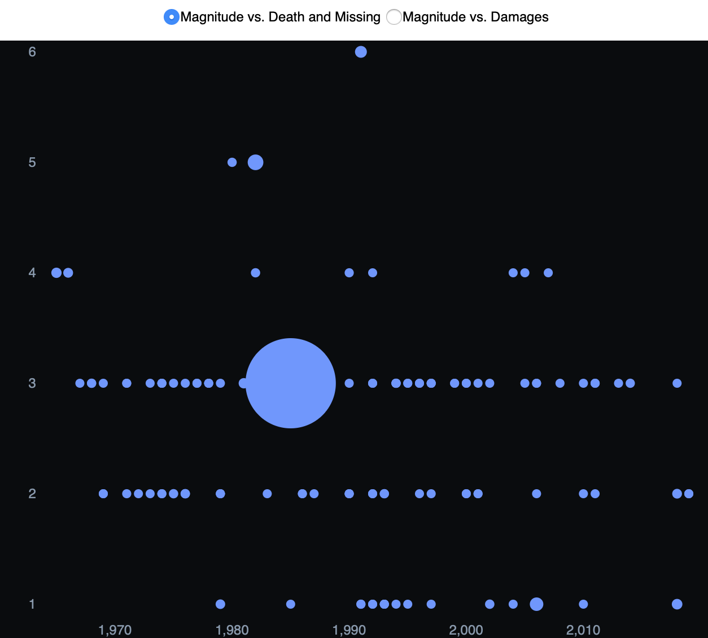

# FP-Hazard-Atlas

## TABLE OF CONTENT
1. [ABSTRACT](#abstract)
2. [INTRODUCTION](#introduction)
3. [RELATED WORK](#related-work)
  * [Interaction Landing Page With Clickable Exploration Website Stories](#interaction-landing-page-with-clickable-exploration-website-stories)
  * [Using Dendrogram to Clarify the Datasets](#using-dendrogram-to-clarify-the-datasets)
  * [Automatically Playable Timeline and Clickable Timeline](#automatically-playable-timeline-and-clickable-timeline)
  * [Mutli-Charts Interaction](#mutli-charts-interaction)
4. [RESULTS](#results)
5. [METHODS](#methods)
6. [DISCUSSION](#discussion)
7. [FUTURE WORK](#future-work)
8. [ACKNOWLEDGMENTS](#acknowledgments)
9. [REFERENCES](#reference)

## ABSTRACT
Earthquakes, volcanoes, and tsunamis are the deadliest disasters in the world. News, books, and other media always broadcast terrible disaster scenes. With the rapid development of the Internet, can we combine data science technology with the latest data visualization tools to create an interactive, user-free disaster interface? To achieve this goal, we used Three.js, D3.js, WebGL, mapboxGL, react.js harp.gl, and leftlet to build the latest visualization platform so that people can understand the past disasters and serve people in disasters. Build a bridge of communication.

## INTRODUCTION

Currently, the pandemic has witnessed the giant influence of disaster on our life, we saw the vulnerable connection between human beings, from the perspective of connection and communication. We started to rethink the connection among people in different kinds of disasters, including natural disasters such as earthquakes, volcanoes, and tsunamis, as well as a disaster like viruses exploding. With the considerable research and interview among the students from MIT and Harvard, we gradually focus on the topic of natural disaster, and try to answer the question, how might we build up a communicative and educational interface that can help people share their thoughts about a natural disaster happening around the world? 

Exploring the datasets of earthquakes, volcanoes, and tsunamis, we observed that these kinds of disasters happen around us every day, and hundreds of thousands of people have suffered from them. Just as John Donne said, no man is an island, even though the hazards still happened around us every day. The project Hazard Atlas aims to build up a platform for people to learn about natural disasters and share their thoughts on them and connect themselves with the ones that have experienced the disaster ever. 

## RELATED WORK

Our interactive storytelling website contains unique interactions between users, including multi-picture related interactions, survey visualizations, and user communication maps.

|  |   | |
|:-------------------------:|:-------------------------:|:-------------------------:|
|Fig.1 The landing page of INCITE|Fig.2 The Dendrogram in LONLINESS|Fig.3 The Timeline in Castle in the Sky|
|  |   | |
|Fig.4 Landing Page of Refugee Flow|Fig.5 Instruction Page of Refugee Flow|Fig.6 Main Page of Refugee Flow|

### Interaction Landing Page With Clickable Exploration Website Stories

INCITE[[1]](https://inciteinc.com) - has a fantastic landing page, which composed of a ring of dynamic particle effects and three clickable points. The three points can be linked to About us, Adventure and other information.

### Using Dendrogram to Clarify the Datasets

LONLINESS[[2]](https://lyip12.github.io/loneliness/) has a hover-able Dendrogram, when users hover on each node, it will highlight the descriptions below the node name. 

### Automatically Playable Timeline and Clickable Timeline

Castle in the Sky[[3]](https://castleinthesky.github.io/#map-page) has a interact-able timeline and uses the color blocks beyond it to represent the frequency. What we loved most is the play button on the left side of the timeline. With it, our users can automatically see the change of the data without clicking on each year. And the timeline is interact able, which is critical, it can make people focus on a specific year as they want.

### Mutli-Charts Interaction

Refugee Flow[[4]](http://refugeeflow.world/) is the most helpful to our ideas. The first idea we got from it is the Landing page. It used a dynamic background picture with changing transparency. In addition, they use the motto as an introduction to allow users to easily enter the corresponding situation and generate empathy. Beside the Landing page, the Instruction page is also inspired us a lot. It would greatly make users understand the interaction that we provided. 

The Main page is a 3D earth, and we want to use the same light beams directly “grow” on the map to represent the data. The different color stands the different fatality count on this website, but for us, we will use the color as the different type of disaster. We really like the expression of this light beam, because it not only represents data, but also symbolizes everyone who has suffered in a disaster.

## RESULTS

## METHODS

|  |   | |
|:-------------------------:|:-------------------------:|:-------------------------:|
|Fig.7 Three.js Website|Fig.9 Line Chart Using D3|Fig.11 Clickable Icon on the Map With Leaflet|
|  |   | |
|Fig.8 3D Map With Three.js|Fig.10 Bubble Chart Using D3||

We have two main goals in this project, the first one is to visualize the natural disaster happening around the world, then a platform for people to share their comments and thoughts around natural disaster topics. We explored several tools and frameworks including mapboxGL, WebGL(three.js), react.js, and D3.js to see the feasibility of the ideas. 

For the visualization part, we mocked up 3 different map to test which one is better for people to understand and read the information of global nature disaster, among them are flatten map built up by mapbox(color is customized to make it readable and has constant style ), global 3D map built with WebGL and unfolded map with D3. 

According to the result collected from questionnaires(attached in appendix) and user research, in which we use several mock-ups to test the acceptability of our interface design, we found that 3D visualization is the easiest and most playful one for users to explore with. The tool we used to build is three.js, it is a JavaScript library and API used to create animated 3 D graphics in the web browser. It allows the creation of GPU-accelerated 3D animation. With this library and example from precedent work, we are able to framework the first draft to do test. 

To fulfill the goal to help users understand natural disasters more through data visualization, D3.js is used in the 3D map to create several chart to visualize the disasters data, including frequency, amplitude and number of natural disasters over the time. 

As a separate part, the sharing platform we want to build is designed to be shown in a flatten map for users to play with. With react.js as a framework, we combined the mapbox API and added the pop-up window function with leaflet library to give user priorities to comment on each point.

To conclude, the combination of WebGL and D3.js make the visualization more attractive and playful to the users, and the use of leaflet, react.js and harp.gl function(thee.js library) create a communicative platform for users to leave their comments and thoughts in this platform. 

## DISCUSSION

## FUTURE WORK

Through the surveys and the peer review from our classmates, we suggest the following set of future directions for improving our interactive interface of disasters visualization:

*Insert the survey into the website.* Surveys are always a fantastic way for us to understand our users better. So, instead of using Google Form as the survey platform, we eagerly combine the survey interface with our website. This new survey interface could make us easily modify the questionnaire to better serve our constantly-updated goals. In addition, we might use the new survey to tell a far more convincing motivation for the website.

*Add user-interactive report system.* As we mentioned above, we want our users to not only be the receiver but a provider, which means we need to add the features of the report system. This system is basically based on the RiskMap, in which the users can click on the map to add a new disaster event on the map and the system will put the report to the website and make other users can focus on the event. To be more specific, this system will collect the time and geographic information of the disaster, and it will also collect the description of the death, injuries and missing information. Based on this new system, our users can easily communicate with each other and make the goal of real-time communication come into being.

*Add message and comment system.* This system is closely related to the report system. But this system will be more focused on communication. For example, the user who first marked the disaster can create a new dialog box, so that other users who are now suffering or want to assist the people in the disaster can use the dialog box to communicate with each other. As we all know, it is hard for people to get first-hand information from the disaster area. Some users can post the information of the missing information of their families or friends and the users who know the information can easily get in touch with them.

*Insert the survey into the website.* Surveys are always a fantastic way for us to understand our users better. So, instead of using Google Form as the survey platform, we eagerly combine the survey interface with our website. This new survey interface could make us easily modify the questionnaire to better serve our constantly-updated goals. In addition, we might use the new survey to tell a far more convincing motivation for the website.

*Mark escape routes.* Through marking the points on the city map, our users can easily share their planning escape routes and get feedback from others. It can not only help themselves but also assist the suffering people who are trapped. 

*Using real-time disaster data from USGS.* USGS can provide the API for the real-time earthquake data, which can make our website more precise and reliable. According to the real-time data from officials, we can filter out some fake events reported by some users.

## ACKNOWLEDGMENTS

When we did this project, we got lots of help from our TFs: Nava Haghighi, Rupayan Neogy, Rishabh Chandra and our Instructor Arvind Satyanarayan. We would like to thank them for their time and kindness during this special time, and express our deepest appreciation to their help.

## REFERENCES

[1]  Ryan Stetz. 2020. INCITE. (2020).https://inciteinc.com.

[2]  Guangyu Du; Lucy Yip; Runjia Tian. 2018.LONLINESS. (2018).https://lyip12.github.io/loneliness/.

[3]  Xu Si; et al. 2018. Castle in the Sky. (2018).https://castleinthesky.github.io/#map-page.

[4]  Will Su. 2017. Refugee Flow. (2017).http://refugeeflow.world/.

